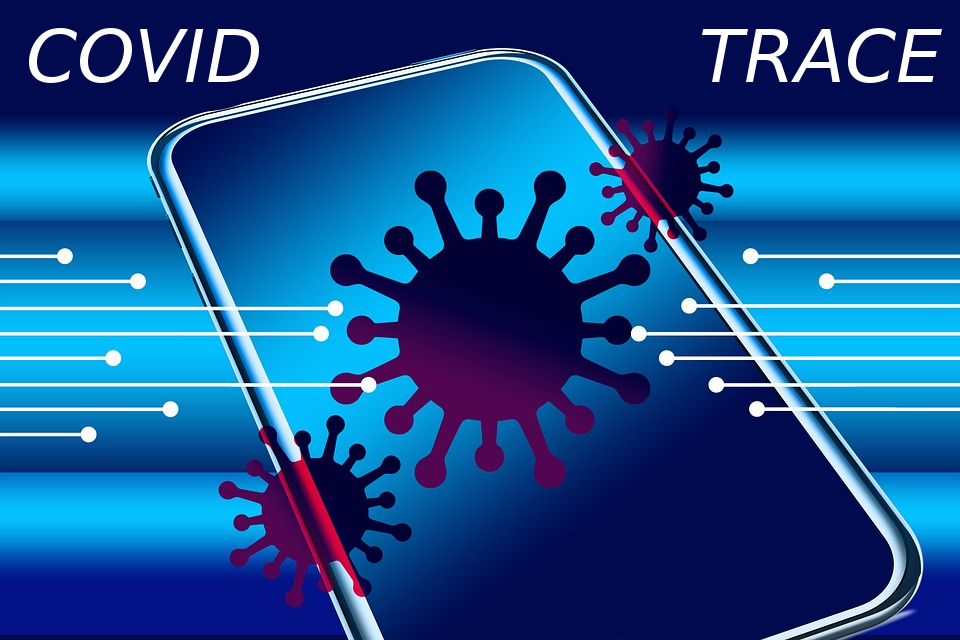

# COVID_trace 

## Resources for contact tracing

- Japan active surveillance guide (English) - [PDF](https://medicalc.github.io/COVID_trace/Active_surveillance_guide_Japan.pdf)
- National Response to COVID-19 in the Republic of Korea and Lessons Learned for Other Countries (English) - [PDF](https://medicalc.github.io/COVID_trace/Juhwan_Oh_2020.pdf) - [Web](https://www.tandfonline.com/doi/full/10.1080/23288604.2020.1753464)
- Comment la démocratie coréenne a-t-elle dompté Covid-19? (Français) - [PDF](https://medicalc.github.io/COVID_trace/covid-en-coree-du-sud-rapport-amblard-partie-i-200417-diffusion-large.pdf)

## Recursos para el trazado de contactos

- Guía para la vigilancia activa de contactos de Japón (en Español) - [PDF](https://medicalc.github.io/COVID_trace/Vigilancia_epidemiologica_activa_Japon.pdf) - [Word](https://medicalc.github.io/COVID_trace/Vigilancia_epidemiologica_activa_Japon.docx)
